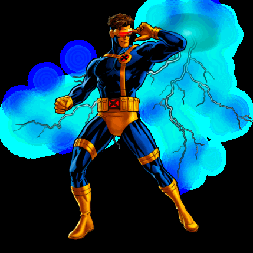

# X-Men Frontend

Projeto de portfolio front-end inspirado no universo X-Men, com foco em animacao, experiencia visual e arquitetura moderna em React.


## Projeto Online

https://viniciuslinck.github.io/X-Men/

## Demo



## Preview da interface


## O que este projeto demonstra

- React componentizado com separacao por dominio (`features`)
- Navegacao com rotas dinamicas (`/heroi/:heroId`)
- Animacoes de entrada e transicoes de rota com GSAP
- Shared-element transition: card expandindo para o banner do heroi
- Fundo 3D interativo com Three.js
- Integracao opcional com API da Marvel
- Responsividade para TV, tablet e celular

## Stack

- HTML + CSS + JavaScript
- React + Vite
- Tailwind CSS
- GSAP
- Three.js
- React Router

## Como executar

### Pre-requisitos

- Node.js 18+
- npm

### Instalar

```bash
npm install
```

### Desenvolvimento

```bash
npm run dev
```

### Build de producao

```bash
npm run build
```

### Preview do build

```bash
npm run preview
```

## Rotas

- `/` -> home com selecao de personagens
- `/heroi/:heroId` -> tela detalhada do heroi selecionado

## Configuracao da API Marvel (opcional)

Crie um `.env` na raiz:

```bash
VITE_MARVEL_PUBLIC_KEY=sua_chave_publica
# opcionais para auth por hash:
# VITE_MARVEL_TS=1
# VITE_MARVEL_HASH=seu_hash_md5
```

Sem chave, os dados locais continuam funcionando normalmente.

## Estrutura de pastas

```text
src/
  app/                    # shell da aplicacao e roteamento
  assets/                 # imagens e arquivos estaticos
  components/             # componentes globais (layout, transicoes, scene)
  features/characters/    # dominio de personagens (dados + componentes)
  hooks/                  # hooks customizados
  pages/                  # HomePage e HeroPage
  services/               # integracoes externas (Marvel API)
  styles/                 # estilos globais
legacy/static/            # versao antiga em HTML/CSS/JS puro
```

## Roadmap

- [x] Base React + Vite + Tailwind + GSAP + Three.js
- [x] Roteamento por heroi
- [x] Shared-element transition card -> hero
- [x] Integracao opcional com Marvel API
- [x] Responsividade inicial TV / tablet / celular
- [ ] Filtro e busca por personagem
- [ ] Theme switch (modo alternativo da interface)
- [ ] Testes E2E de navegacao
- [ ] Deploy publico com dominio proprio

## Autor

Projeto desenvolvido para portfolio e evolucao em front-end moderno.
